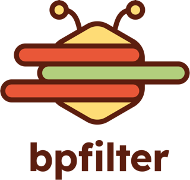

<p align="center">
    <picture>
        <source media="(prefers-color-scheme: dark)" srcset="doc/_static/logo-dark-mode.png">
        <source media="(prefers-color-scheme: light)" srcset="doc/_static/logo-light-mode.png">
        
    </picture>
</p>

---

<h3 align="center">An <a href="https://ebpf.io/">eBPF</a>-based packet filtering framework.</h3>

**bpfilter** transforms how you control network traffic by leveraging the power of eBPF technology. This framework elegantly translates filtering rules into optimized BPF programs, bringing unparalleled performance and flexibility to your packet filtering needs.

<p align="center">
    <a href="README.md#key-features">Key features</a> •
    <a href="README.md#quick-start">Quick start</a> •
  <a href="https://bpfilter.io/">Documentation</a>
</p>

<p align="center">
    <picture>
        <source media="(prefers-color-scheme: dark)" srcset="doc/_static/demo_dark.gif">
        <source media="(prefers-color-scheme: light)" srcset="doc/_static/demo_light.gif">
        
    </picture>
</p>

## Key features

- **High performance**: utilizes eBPF's near-native performance capabilities
- **Flexible integration**: use the custom `iptables` integration or **bpfilter**'s `bfcli` command line for extended functionalities
- **Low overhead**: minimal resource consumption with maximized efficiency
- **Developer-friendly**: clean architecture with clear separation of components

**bpfilter** combines three components: a CLI that allows users to define filtering rules in human-readable text, a daemon that converts these rules into efficient BPF programs, and a library that facilitates seamless communication between applications and the filtering subsystem.

Want to know more about **bpfilter**? Check the [user's guide](https://bpfilter.io/usage/index.html), the [developer documentation](https://bpfilter.io/developers/build.html), or watch our latest [public talk](https://www.youtube.com/watch?v=fzaPEm4PXn0)!

## Quick start

### Install

**bpfilter** is packaged for Fedora 40+, EPEL 9+ and supports Fedora 40+, CentOS Stream 9+, and Ubuntu 24.04+. The examples below uses Fedora 41.

```shell
# Fedora 40+ or CentOS Stream 9+ (with EPEL)
sudo dnf install -y bpfilter bpfilter-devel
```

### Build from sources

```shell
# Essential build requirements
sudo dnf install -y cmake gcc libbpf-devel libnl3-devel bison flex

# Configure the project and build bpfilter
cmake -S $SOURCES_DIR -B $BUILD_DIR -DNO_DOCS=ON -DNO_TESTS=ON -DNO_CHECKS=ON -DNO_BENCHMARKS=ON
make -C $BUILD_DIR install
```

### Usage

```shell
# Start the daemon
sudo $BUILD_DIR/output/sbin/bpfilter

# Count the number of ping coming to interface #2
sudo $BUILD_DIR/output/sbin/bfcli ruleset set --from-str "chain my_chain BF_HOOK_XDP{ifindex=2} ACCEPT rule ip4.proto icmp counter ACCEPT"
```

The complete documentation is available on [bpfilter.io](https://bpfilter.io/).

## License

**bpfilter** is licensed under GPLv2. You can find the licensing details in the COPYING file.

## Acknowledgements

**bpfilter** was initially designed by [Alexei Starovoitov with help from David S. Miller and Daniel Borkmann](https://lore.kernel.org/lkml/20180503043604.1604587-1-ast@kernel.org/) as a Linux kernel usermode helper, and later improved by [Dmitrii Banshchikov](https://lore.kernel.org/bpf/20210829183608.2297877-1-me@ubique.spb.ru/).
